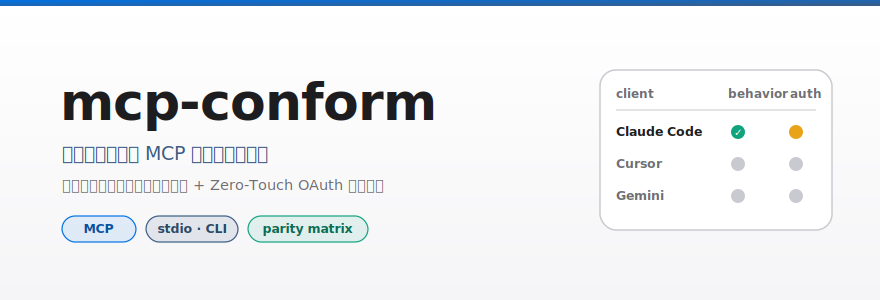
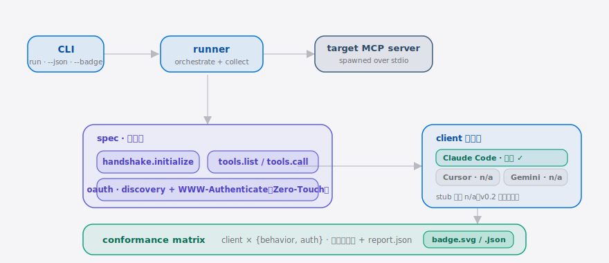

<div align="right"><sub><b>English</b>&nbsp;&nbsp;|&nbsp;&nbsp;<a href="./README.md">简体中文</a></sub></div>

<picture>
  <source media="(prefers-color-scheme: dark)" srcset="./assets/hero-dark.svg">
  <source media="(prefers-color-scheme: light)" srcset="./assets/hero-light.svg">
  
</picture>

<p><sub>mcp-conform is the neutral cross-client <b>MCP</b> conformance harness that emits a per-client behavior + Zero-Touch OAuth parity matrix from a single command.</sub></p>

<p align="center">
  <a href="./LICENSE"></a>
  <a href="https://github.com/SuperMarioYL/mcp-conform/releases"></a>
  <a href="https://github.com/SuperMarioYL/mcp-conform/actions/workflows/ci.yml"></a>
  = 20">
  
  
</p>

**Pain → fix: today you have anecdotes ("works in Cursor, not Claude Code") but no proof. mcp-conform runs any MCP server through behavior + OAuth checks with one `npx` command and hands you a publishable per-client conformance matrix.**

`awesome-mcp-servers` ([punkpeye/awesome-mcp-servers](https://github.com/punkpeye/awesome-mcp-servers), 89k★) solves *discovery*, and the Zero-Touch OAuth spec defines *enterprise auth* — but nothing between them **asserts** that a given server actually implements the spec correctly across clients. That empty space belongs to a neutral tool by construction: no single client vendor is incentivized to certify that it behaves identically to its competitors. The servers under test are **Coding Agent** tools — e.g. [ChromeDevTools/chrome-devtools-mcp](https://github.com/ChromeDevTools/chrome-devtools-mcp) (44k★), exactly the kind of non-trivial server whose author carries the cross-client burden. mcp-conform is the harness that sits in that gap.

## Contents

- [Architecture](#architecture)
- [Install & Quickstart](#install--quickstart)
- [Usage](#usage)
- [Demo](#demo)
- [vs awesome-mcp-servers](#vs-awesome-mcp-servers)
- [Roadmap](#roadmap)
- [License](#license)

<h2 id="architecture"> Architecture</h2>

A single Node CLI, one process (plus the spawned server child). `runner` orchestrates: pick the adapter → spawn the target server over stdio → run the pure `spec/*` check functions → collect results → `report/*` renders the matrix and writes the badge.

<picture>
  <source media="(prefers-color-scheme: dark)" srcset="./assets/atlas-dark.svg">
  <source media="(prefers-color-scheme: light)" srcset="./assets/atlas-light.svg">
  
</picture>

The core primitive is the **conformance matrix**: a typed report keyed by `(client, axis, check_id)`, with `axis ∈ {behavior, auth}`, `status ∈ {pass, fail, skip, n/a}`, and the failing assertion named on `fail`. It is a genuinely new noun — nothing today asserts identical cross-client behavior in a single typed report.

<h2 id="install--quickstart"> Install & Quickstart</h2>

No install required — run the bundled echo fixture with `npx` (cold clone to first result in ≤3 commands):

```bash
git clone https://github.com/SuperMarioYL/mcp-conform && cd mcp-conform
npm install && npm run build
npx mcp-conform run node ./dist/fixtures/echo-server/server.js --badge
```

<details><summary>sample output</summary>

```text
mcp-conform — conformance matrix (spec 0.1)
server: node ./dist/fixtures/echo-server/server.js  [stdio]

Client       behavior  auth
-------------------------------
Claude Code  ✓ pass    ~ skip
Cursor*      - n/a     - n/a
Gemini*      - n/a     - n/a

All applicable checks passed (n/a = adapter stubbed, skip = optional).

* = adapter stubbed (returns n/a) — real adapter lands in a later release.
```

`--badge` additionally writes `badge.svg` / `badge.json` you can paste into your own README.
</details>

<h2 id="usage"> Usage</h2>

The only subcommand is `run`, followed by the full command that launches your server:

```bash
# 1. Run your own server (any executable command, stdio transport)
npx mcp-conform run node ./my-mcp-server.js

# 2. Emit stable JSON to assert against in CI
npx mcp-conform run node ./my-mcp-server.js --json

# 3. Write a badge + full report to paste into your README / commit
npx mcp-conform run node ./my-mcp-server.js --badge --report
```

| Option | Effect |
| --- | --- |
| `--json` | Print the typed matrix as JSON instead of the colored table (CI-friendly) |
| `--badge [dir]` | Write `badge.svg` + `badge.json` |
| `--report [path]` | Write the full `report.json` |
| `--cwd <dir>` | Working directory for the spawned server |
| `--timeout <ms>` | Handshake timeout (default 15000) |

Exit code: any `fail` → exit `1` (red CI); `n/a` and `skip` never fail CI. See [`examples/`](./examples/) for more.

<h2 id="demo"> Demo</h2>


> The 30-second happy path: `npx mcp-conform run` → stdio spawn → handshake/tools green → OAuth yellow (optional) → render the client × {behavior, auth} matrix → write the badge, exit 0.

<h2 id="vs-awesome-mcp-servers"> vs awesome-mcp-servers</h2>

An honest comparison with [punkpeye/awesome-mcp-servers](https://github.com/punkpeye/awesome-mcp-servers) — not a competitor, but the directory mcp-conform stands right beside:

| Axis | awesome-mcp-servers | mcp-conform |
| --- | :---: | :---: |
| Servers discovered / curated | ✓ (89k★ of curation breadth) | — |
| Actually runs a server and asserts behavior | — | ✓ |
| Zero-Touch OAuth verification | — | ✓ (discovery / metadata / challenge shape) |
| Per-client conformance matrix + badge | — | ✓ |
| Real adapter coverage | n/a | partial (Claude Code only; Cursor / Gemini return `n/a`) |

It wins outright on *breadth* — a curated README will always list more servers than a test tool. mcp-conform doesn't compete there; it fills the "is this server actually conformant across clients?" action the directory can't take on.

<h2 id="roadmap"> Roadmap</h2>

- [x] **m1 · run the spec suite** — `run` spawns the server over stdio, runs handshake + tools checks, prints pass/fail.
- [x] **m2 · emit the parity matrix** — Claude Code adapter + OAuth discovery checks, colored client × {auth, behavior} matrix + `badge.svg` / `report.json`.
- [x] **m3 · canonical fixture** — bundled echo fixture, green matrix reproducible in one command.
- [ ] **Cursor adapter** — turn the matrix's second row from `n/a` into real checks (v0.2).
- [ ] **Gemini adapter** — a third real client (v0.2+).
- [ ] **Deeper OAuth** — go beyond discovery/shape to an end-to-end token grant.

## License

[MIT](./LICENSE). Issues and PRs welcome: found a server that behaves differently across clients, or want to add a new client adapter? Open an issue with the repro command.

<p align="center"><sub><a href="./LICENSE">MIT</a> © 2026 SuperMarioYL</sub></p>
