[English](./README.en.md) · [Website](https://mcp-conform.lei6393.com) · [GitHub](https://github.com/SuperMarioYL/mcp-conform)

<picture>
  <source media="(max-width: 600px) and (prefers-color-scheme: dark)" srcset="./assets/presentation/hero-mobile-dark.svg">
  <source media="(max-width: 600px)" srcset="./assets/presentation/hero-mobile-light.svg">
  <source media="(prefers-color-scheme: dark)" srcset="./assets/presentation/hero-dark.svg">
  
</picture>

# mcp-conform

**接入前，看清 MCP 服务的行为**

mcp-conform 启动 stdio MCP 服务，通过 MCP SDK 检查握手和工具，再生成行为与认证矩阵。未实现的客户端适配器保持 n/a。

## 为什么需要它

服务可能展示看似有效的工具列表，却在初始化或调用时失败。可重复的协议场景能在加入 Agent 配置前暴露这些问题。

- **运行真实服务进程** — 测试器通过 stdio 启动目标进程，并检查实际连接。
- **呈现覆盖边界** — 矩阵区分 pass、fail、skip 和 n/a。
- **在 CI 中使用结果** — JSON 报告和 SVG 徽章来自同一组检查结果。

## 架构

<picture>
  <source media="(max-width: 600px) and (prefers-color-scheme: dark)" srcset="./assets/presentation/architecture-mobile-dark.svg">
  <source media="(max-width: 600px)" srcset="./assets/presentation/architecture-mobile-light.svg">
  <source media="(prefers-color-scheme: dark)" srcset="./assets/presentation/architecture-dark.svg">
  
</picture>

runner.ts 使用 StdioClientTransport 启动服务并初始化 MCP Client。名为 claude-code 的已实现适配器运行握手、工具 Schema 和调用检查。提供 baseUrl 后，OAuth 发现通过独立 HTTP 探测完成。Cursor 与 Gemini 适配器只输出 n/a 行，不会执行这些应用。

| 组件 | 职责 |
| --- | --- |
| `Server process` | stdio transport |
| `MCP SDK client` | initialize connection |
| `Check suite` | handshake / tools / auth |
| `Matrix + badge` | status and evidence |

## 安装与快速上手

需要 Node.js 22+。构建会同时编译测试器和随仓样本服务。

```bash
git clone https://github.com/SuperMarioYL/mcp-conform.git
cd mcp-conform
npm ci
npm run build
```

完整命令启动随仓 echo 服务，在本地收发实际 MCP 消息，不调用模型或外部客户端应用。

```bash
node dist/cli.js run node dist/fixtures/echo-server/server.js --json
```

## 实际运行示例

<picture>
  <source media="(max-width: 600px) and (prefers-color-scheme: dark)" srcset="./assets/presentation/process-mobile-dark.svg">
  <source media="(max-width: 600px)" srcset="./assets/presentation/process-mobile-light.svg">
  <source media="(prefers-color-scheme: dark)" srcset="./assets/presentation/process-dark.svg">
  
</picture>

The bundled echo server is checked over stdio; Cursor/Gemini remain n/a and OAuth is skipped.

```text
{
  "spec_version": "0.1",
  "server": {
    "cmd": "node dist/fixtures/echo-server/server.js",
    "transport": "stdio"
  },
  "cells": [
    {
      "client": "claude-code",
      "axis": "behavior",
      "status": "pass"
    },
    {
      "client": "claude-code",
      "axis": "auth",
      "status": "skip"
    },
    {
      "client": "cursor",
      "axis": "behavior",
      "status": "n/a"
    },
    {
      "client": "cursor",
      "axis": "auth",
      "status": "n/a"
    },
    {
      "client": "gemini",
      "axis": "behavior",
      "status": "n/a"
    },
    {
      "client": "gemini",
      "axis": "auth",
      "status": "n/a"
    }
  ]
}
```

完整命令与输出保存在 [docs/demo-results.json](./docs/demo-results.json). 输入和复现代码均随仓提供。

## 用法

将样本命令替换为准备测试的服务启动命令。--cwd 指定工作目录，--timeout 设置握手超时毫秒数，默认 15000。--report 和 --badge 可指定输出路径。任何 fail 都返回 1，skip 和 n/a 不使 CI 失败。

```bash
node dist/cli.js run node dist/fixtures/echo-server/server.js --json
node dist/cli.js run node dist/fixtures/echo-server/server.js --badge --report
```

## 配置

仅在准备探测某个 HTTP 资源的 OAuth 元数据时使用 --base-url。省略后 stdio 的 auth 单元保持 skip。存在 echo 时优先调用，否则从候选工具 Schema 推导最小参数，无法支持的合成调用可能被跳过。应阅读各检查行，不能把绿色徽章理解为全面兼容。

## 集成与职责分工

<picture>
  <source media="(max-width: 600px) and (prefers-color-scheme: dark)" srcset="./assets/presentation/integrations-mobile-dark.svg">
  <source media="(max-width: 600px)" srcset="./assets/presentation/integrations-mobile-light.svg">
  <source media="(prefers-color-scheme: dark)" srcset="./assets/presentation/integrations-dark.svg">
  
</picture>

报告描述本测试器的协议检查。claude-code 行是适配器名称，并不证明启动过 Claude Code 桌面或 CLI 应用。认证发现只检查元数据和挑战格式，不完成 OAuth Token 授权。

| 路径 | 已实现职责 |
| --- | --- |
| stdio MCP | child process transport |
| MCP SDK | protocol handshake and tool calls |
| HTTP metadata | optional OAuth discovery |
| JSON report | CI-readable check rows |
| SVG badge | derived matrix summary |

## 限制与后续方向

- 只有一个适配器执行 SDK 检查。Cursor 和 Gemini 是占位实现，三个名称对应的客户端应用都不会被启动。
- 启动任意服务会运行其代码，tools.call 也可能产生作用。应使用可控服务和样本数据。
- 本地示例未运行 OAuth 发现或端到端授权。

已实现 stdio 握手与工具检查、稳定报告行、JSON 和徽章输出，以及可选 HTTP 发现探测。更深入的 OAuth 授权和真实客户端兼容覆盖仍属后续方向。支持行为的变更见 CHANGELOG.md。

## 许可与贡献

许可见 [LICENSE](./LICENSE). 反馈问题时请提供最小输入、执行命令和实际输出。
